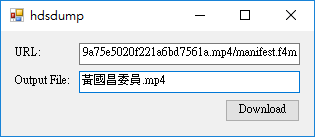

HDSDump 1.0
===========
Up to and including version 1.0.3.7 this is was porting [AdobeHDS.php by K-S-V](https://github.com/K-S-V/Scripts/blob/master/AdobeHDS.php) to .NET 2.0 platform.

HDSDump 2.0
===========
Completely rewritten. Used .NET 4.0 platform.

HDSDump-GUI
===========
Add a simple GUI form to HDSDump 2.0



Overview
--------
HDSDump is command-line utility for dumping [HDS stream](http://www.adobe.com/ru/products/hds-dynamic-streaming.html) to the FLV file or pipe to other media player (such as VLC).

Features
--------
* Multi-level nested manifests support
* Flash® Media Manifest (F4M) format version 3.0 support
* Selection alternate audio (if exists) by language, codec, bitrate or label
* Akamai DRM decryption (from AdobeHDS.php by K-S-V)
* Piping stream into other applications or processes
* Not breaking if live stream is interrupted

Usage
-----

Dumping stream to file:

```
hdsdump.exe --showtime --manifest "http://184.72.239.149/vod/smil:bigbuckbunny.smil/manifest.f4m" --outfile "bigbuckbunny.flv"
```
or with short switches:
```
hdsdump.exe -st -m "http://184.72.239.149/vod/smil:bigbuckbunny.smil/manifest.f4m" -o "bigbuckbunny.flv"
```


Select quality, start time and duration:
```
hdsdump.exe -q 720 --skip 00:01:30 --duration 00:00:45 -m http://184.72.239.149/vod/smil:bigbuckbunny.smil/manifest.f4m
```

Dumping live stream:
```
hdsdump.exe -m http://zouglahd-f.akamaihd.net/z/zougla_1@56341/manifest.f4m
```

Piping to VLC player:

(Windows)
```
hdsdump.exe -m http://dr01-lh.akamaihd.net/z/dr01_0@147054/manifest.f4m?hdcore=3.1.0 -H "X-Forwarded-For:2.104.1.207" | "%ProgramFiles(x86)%\VideoLAN\VLC\vlc.exe" --file-caching=10000 -
```

(Linux, Mac with mono runtime)
```
mono hdsdump.exe -m http://zouglahd-f.akamaihd.net/z/zougla_1@56341/manifest.f4m -p | vlc.exe -
```

Sets additional HTTP headers:
```
hdsdump.exe -m <manifest_url> -H "X-Forwarded-For:1.2.3.4" -H "Authorization: Bearer mF_9.B5f-4.1JqM" --useragent "iPhone 6 CDMA"
```

Select audio by language if alt media is present in manifest:
```
hdsdump.exe -m <manifest_url> --lang eng,es
```

or select audio by label if alt media is present:
```
hdsdump.exe -m <manifest_url> --alt spanish
```

Remux with ffmpeg:
```
hdsdump.exe -m <manifest_url> | ffmpeg -i - -c copy out.mp4
```

Encoding with ffmpeg:
```
hdsdump.exe -m <manifest_url> | ffmpeg -i - -c:v libx265 -c:a copy OUT.mpg
```

Switches
--------

Print all possible switches can be done by running the command:
`hdsdump.exe -h`

```
hdsdump.exe -h
You can use hdsdump with following switches:

 -h |--help              displays this help
 -l |--debug             out debug output to log file
 -p |--play              dump flv data to stderr for piping to another program
 -st|--showtime          show time remaining
 -op|--osproxy           use system proxy (by OS)
 -fp|--fproxy            force proxy for downloading of fragments
     --postdata          data for the POST method for http request
 -wk|--waitkey           wait pressed any key at the end
 -c |--continue          continue if possible downloading with exists file
 -z |--oldmethod         use the old method to download
     --quiet             no output any messages
 -v |--verbose           show exteneded info while dumping
     --testalt           sets all avaliable media also as alternate
 -a |--auth      <param> authentication string for fragment requests (add '?' with parameter to end manifest url)
 -t |--duration  <param> stop dumping after specified time in the file (hh:mm:ss)
 -fs|--filesize  <param> limit size of the output file
 -m |--manifest  <param> path or url to manifest file for dumping stream (f4m)
 -b |--urlbase   <param> base url for relative path in manifest
 -od|--outdir    <param> destination folder for output file
 -o |--outfile   <param> filename to use for output file
 -th|--threads   <param> number of threads to download fragments
 -q |--quality   <param> selected quality level (low|medium|high) or exact bitrate
 -ss|--skip      <param> skip time hh:mm:ss
 -f |--start     <param> start from specified fragment
 -lf|--logfile   <param> file for debug output
 -ua|--useragent <param> user-Agent to use for emulation of browser requests
 -re|--referer   <param> referer in the headers http requests
 -ck|--cookies   <param> cookies in the headers http requests
 -H |--headers   <param> http header
 -un|--username  <param> username to use for access to http server
 -ps|--password  <param> password to use for access to http server
 -px|--proxy     <param> proxy for downloading of manifest (http://proxyAddress:proxyPort)
 -pu|--proxyuser <param> username for proxy server
 -pp|--proxypass <param> password for proxy server
     --adkey     <param> Akamai DRM session key as hexadecimal string
     --lang      <param> default language for audio if alternate audio is present
     --alt       <param> select alternate audio by language, codec, bitrate, streamId or label
```
